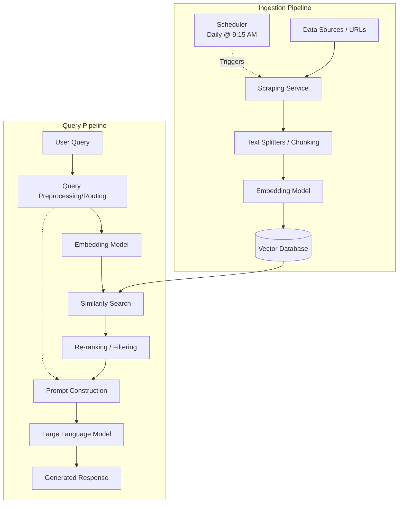

# Retrieval-Augmented Generation (RAG) Architecture

*Note: This architecture has been tailored for a mutual fund analysis and Q&A system, with a specific scope focusing on HDFC mutual funds.*

## 1. System Overview

The proposed RAG system is designed to provide accurate, context-aware responses by combining a knowledge retrieval mechanism with a Large Language Model (LLM). The architecture is divided into two primary pipelines:
1. **Data Ingestion Pipeline**: For processing and storing domain-specific knowledge.
2. **Retrieval & Generation Pipeline**: For handling user queries and generating informed responses.

## 2. High-Level Architecture Diagram

## 3. Component Details

### 3.1 Data Ingestion Pipeline
*   **Data Sources (In Scope):** The primary knowledge base consists of information extracted from the following IndMoney mutual fund pages:
    *   [HDFC Housing Opportunities Fund](https://www.indmoney.com/mutual-funds/hdfc-housing-opportunities-fund-direct-growth-9006)
    *   [HDFC Mid-Cap Opportunities Fund](https://www.indmoney.com/mutual-funds/hdfc-mid-cap-fund-direct-plan-growth-option-3097)
    *   [HDFC Focused 30 Fund](https://www.indmoney.com/mutual-funds/hdfc-focused-fund-direct-plan-growth-option-2795)
    *   [HDFC Flexi Cap Fund](https://www.indmoney.com/mutual-funds/hdfc-flexi-cap-fund-direct-plan-growth-option-3184)
    *   [HDFC Small Cap Fund](https://www.indmoney.com/mutual-funds/hdfc-small-cap-fund-direct-growth-option-3580)
*   **Scheduler:** An automated process (e.g., Cron job or APScheduler) configured to run **every day at 9:15 AM**. This ensures the system proactively fetches the latest mutual fund data on a daily basis.
*   **Scraping Service:** A dedicated service triggered by the scheduler to get the latest data directly from the in-scope URLs. It uses web scraping techniques (e.g., `AsyncHtmlLoader`, `Playwright`, or custom `BeautifulSoup` scripts) to fetch and parse the HTML content, extracting key metrics, NAV, fund descriptions, holding details, and historical performance.
*   **Text Splitters:** Logic to break down large documents into smaller, semantically meaningful chunks (e.g., 500-1000 tokens with 10% overlap). This improves retrieval accuracy.
*   **Embedding Model:** HuggingFace `BAAI/bge-small-en-v1.5` that converts text chunks into dense vector representations.
*   **Vector Database:** **Chroma Cloud** via `chromadb.HttpClient` to store and efficiently search the vector embeddings remotely.

### 3.2 Retrieval & Generation Pipeline
*   **User Query:** The initial question or prompt from the end user.
*   **Query Preprocessing:** Cleaning, rewriting, or expanding the user query to maximize the chances of retrieving relevant context.
*   **Similarity Search:** Comparing the query embedding against the vector database to retrieve the top-K most relevant document chunks.
*   **Re-ranking (Optional but recommended):** A cross-encoder model (e.g., Cohere Rerank) that re-scores the retrieved chunks to ensure the most highly relevant context is passed to the LLM.
*   **Prompt Construction:** Combining the user's original query, the retrieved context chunks, and system instructions into a single, cohesive prompt.
*   **Large Language Model (LLM):** The generative model (e.g., GPT-4o, Claude 3.5 Sonnet, Llama 3) that synthesizes the retrieved information to answer the user's query.

### 3.3 Application & Orchestration Layer
*   **Orchestration Framework:** LangChain or LlamaIndex to chain together the ingestion and retrieval processes.
*   **Backend API:** FastAPI or Flask to serve the RAG pipeline as a RESTful service.
*   **Frontend:** A user interface (e.g., Next.js, Streamlit, or Gradio) for user interaction.

## 4. Evaluation and Monitoring
*   **RAG Metrics:** Evaluate retrieval (Precision/Recall) and generation (Faithfulness, Answer Relevance) using frameworks like Ragas or TruLens.
*   **Observability:** Implement tracing (e.g., LangSmith, Phoenix) to monitor latency, cost, and LLM input/output for continuous improvement.

## 5. Next Steps
1. **Develop Scraping Service:** Implement the web scrapers to reliably extract the relevant text, charts, and tabular data from the 5 in-scope IndMoney URLs.
2. **Implement Scheduler:** Configure the automated job to trigger the scraping service every day at 9:15 AM.
3. **Data Cleaning & Chunking:** Process the scraped HTML to remove noise (headers, footers, ads) and split the core fund information into semantic chunks suitable for embedding.
4. **Technology Selection:** Finalize the choice of vector database (**Chroma Cloud**) and the embedding model.
5. **Prototype Ingestion:** Run the scheduled ingestion pipeline for the 5 URLs and verify that the vector embeddings accurately represent the fund details and are easily retrievable.
